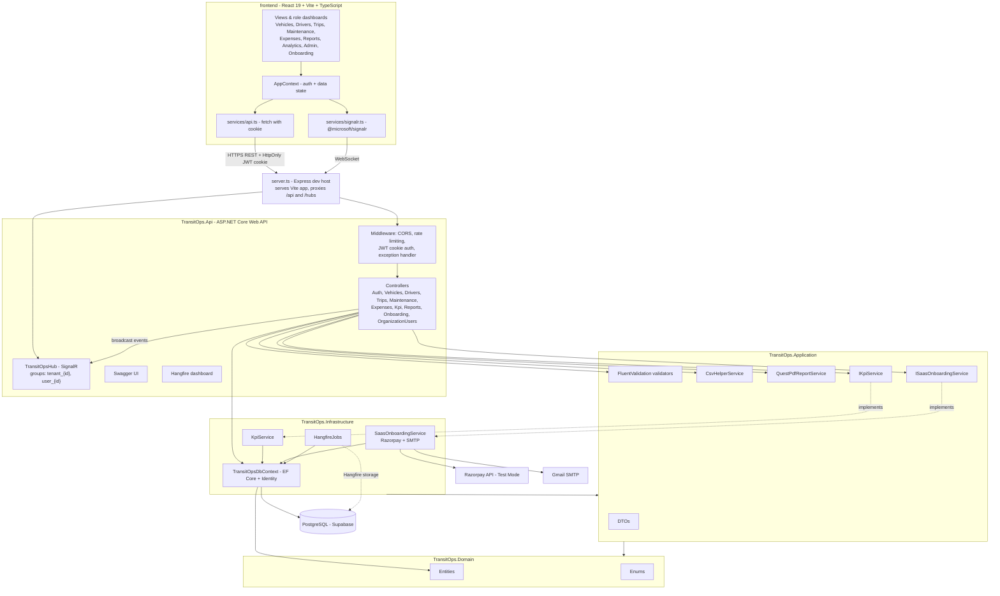
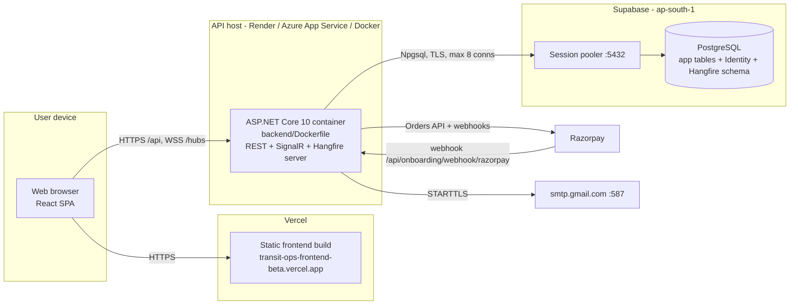
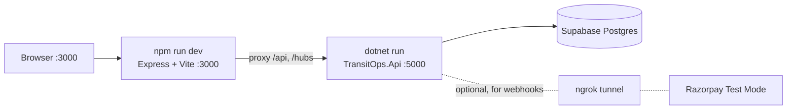

# 2. Architecture: Component and Deployment Diagrams

## 2.1 Component diagram (clean architecture layers)

```mermaid
flowchart TB
    subgraph FE["frontend - React 19 + Vite + TypeScript"]
        direction TB
        VIEWS["Views & role dashboards<br/>Vehicles, Drivers, Trips, Maintenance,<br/>Expenses, Reports, Analytics, Admin, Onboarding"]
        CTX["AppContext - auth + data state"]
        APIJS["services/api.ts - fetch with cookie"]
        SRJS["services/signalr.ts - @microsoft/signalr"]
        VIEWS --> CTX --> APIJS
        CTX --> SRJS
    end

    BRIDGE["server.ts - Express dev host<br/>serves Vite app, proxies /api and /hubs"]

    subgraph API["TransitOps.Api - ASP.NET Core Web API"]
        direction TB
        MW["Middleware: CORS, rate limiting,<br/>JWT cookie auth, exception handler"]
        CTRL["Controllers<br/>Auth, Vehicles, Drivers, Trips, Maintenance,<br/>Expenses, Kpi, Reports, Onboarding, OrganizationUsers"]
        HUB["TransitOpsHub - SignalR<br/>groups: tenant_{id}, user_{id}"]
        SWAG["Swagger UI"]
        HFD["Hangfire dashboard"]
        MW --> CTRL
    end

    subgraph APP["TransitOps.Application"]
        DTO["DTOs"]
        VAL["FluentValidation validators"]
        CSV["CsvHelperService"]
        PDF["QuestPdfReportService"]
        IKPI["IKpiService"]
        ISAAS["ISaasOnboardingService"]
    end

    subgraph INF["TransitOps.Infrastructure"]
        DB["TransitOpsDbContext - EF Core + Identity"]
        KPI["KpiService"]
        SAAS["SaasOnboardingService<br/>Razorpay + SMTP"]
        JOBS["HangfireJobs"]
    end

    subgraph DOM["TransitOps.Domain"]
        ENT["Entities"]
        ENUM["Enums"]
    end

    PG[("PostgreSQL - Supabase")]
    RZP["Razorpay API - Test Mode"]
    MAIL["Gmail SMTP"]

    APIJS -- "HTTPS REST + HttpOnly JWT cookie" --> BRIDGE
    SRJS -- "WebSocket" --> BRIDGE
    BRIDGE --> MW
    BRIDGE --> HUB
    CTRL --> VAL & CSV & PDF & IKPI & ISAAS & DB
    CTRL -- "broadcast events" --> HUB
    IKPI -.implements.-> KPI
    ISAAS -.implements.-> SAAS
    KPI & SAAS & JOBS --> DB
    DB --> ENT
    APP --> DOM
    INF --> APP
    DB --> PG
    JOBS -. "Hangfire storage" .-> PG
    SAAS --> RZP & MAIL
```

## 2.2 Deployment diagram

```mermaid
flowchart LR
    subgraph CLIENT["User device"]
        BROWSER["Web browser<br/>React SPA"]
    end

    subgraph VERCEL["Vercel"]
        STATIC["Static frontend build<br/>transit-ops-frontend-beta.vercel.app"]
    end

    subgraph HOST["API host - Render / Azure App Service / Docker"]
        DOTNET["ASP.NET Core 10 container<br/>backend/Dockerfile<br/>REST + SignalR + Hangfire server"]
    end

    subgraph SUPA["Supabase - ap-south-1"]
        PGDB[("PostgreSQL<br/>app tables + Identity + Hangfire schema")]
        POOL["Session pooler :5432"]
    end

    RZP["Razorpay"]
    GMAIL["smtp.gmail.com :587"]

    BROWSER -- "HTTPS" --> STATIC
    BROWSER -- "HTTPS /api, WSS /hubs" --> DOTNET
    DOTNET -- "Npgsql, TLS, max 8 conns" --> POOL --> PGDB
    DOTNET -- "Orders API + webhooks" --> RZP
    RZP -- "webhook /api/onboarding/webhook/razorpay" --> DOTNET
    DOTNET -- "STARTTLS" --> GMAIL
```

### Local development (your laptop)

```mermaid
flowchart LR
    B["Browser :3000"] --> EX["npm run dev<br/>Express + Vite :3000"]
    EX -- "proxy /api, /hubs" --> API["dotnet run<br/>TransitOps.Api :5000"]
    API --> SB[("Supabase Postgres")]
    API -. "optional, for webhooks" .- NG["ngrok tunnel"]
    NG -.- RZ["Razorpay Test Mode"]
```
