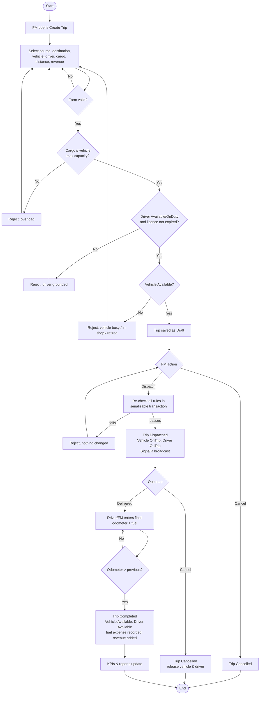
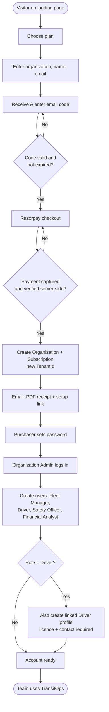
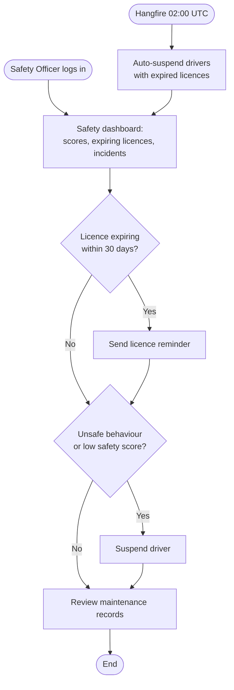

# 7. Activity Diagrams

## 7.1 End-to-end trip workflow

```mermaid
flowchart TD
    S([Start]) --> A[FM opens Create Trip]
    A --> B[Select source, destination,<br/>vehicle, driver, cargo, distance, revenue]
    B --> C{Form valid?}
    C -- No --> B
    C -- Yes --> D{Cargo ≤ vehicle<br/>max capacity?}
    D -- No --> X1[Reject: overload] --> B
    D -- Yes --> E{Driver Available/OnDuty<br/>and licence not expired?}
    E -- No --> X2[Reject: driver grounded] --> B
    E -- Yes --> F{Vehicle Available?}
    F -- No --> X3[Reject: vehicle busy / in shop / retired] --> B
    F -- Yes --> G[Trip saved as Draft]
    G --> H{FM action}
    H -- Cancel --> Z1[Trip Cancelled] --> E1([End])
    H -- Dispatch --> I[Re-check all rules in<br/>serializable transaction]
    I -- fails --> X4[Reject, nothing changed] --> H
    I -- passes --> J[Trip Dispatched<br/>Vehicle OnTrip, Driver OnTrip<br/>SignalR broadcast]
    J --> K{Outcome}
    K -- Cancel --> L[Trip Cancelled<br/>release vehicle & driver] --> E1
    K -- Delivered --> M[Driver/FM enters final odometer + fuel]
    M --> N{Odometer > previous?}
    N -- No --> M
    N -- Yes --> O[Trip Completed<br/>Vehicle Available, Driver Available<br/>fuel expense recorded, revenue added]
    O --> P[KPIs & reports update] --> E1
```

## 7.2 Organization onboarding and user provisioning

```mermaid
flowchart TD
    S([Visitor on landing page]) --> A[Choose plan]
    A --> B[Enter organization, name, email]
    B --> C[Receive & enter email code]
    C --> D{Code valid and<br/>not expired?}
    D -- No --> C
    D -- Yes --> E[Razorpay checkout]
    E --> F{Payment captured<br/>and verified server-side?}
    F -- No --> E
    F -- Yes --> G[Create Organization + Subscription<br/>new TenantId]
    G --> H[Email: PDF receipt + setup link]
    H --> I[Purchaser sets password]
    I --> J[Organization Admin logs in]
    J --> K[Create users: Fleet Manager,<br/>Driver, Safety Officer, Financial Analyst]
    K --> L{Role = Driver?}
    L -- Yes --> M[Also create linked Driver profile<br/>licence + contact required]
    L -- No --> N[Account ready]
    M --> N --> E1([Team uses TransitOps])
```

## 7.3 Safety Officer daily workflow

```mermaid
flowchart TD
    S([Safety Officer logs in]) --> A[Safety dashboard:<br/>scores, expiring licences, incidents]
    A --> B{Licence expiring<br/>within 30 days?}
    B -- Yes --> C[Send licence reminder]
    B -- No --> D{Unsafe behaviour<br/>or low safety score?}
    C --> D
    D -- Yes --> E[Suspend driver]
    D -- No --> F[Review maintenance records]
    E --> F
    F --> G([End])
    H([Hangfire 02:00 UTC]) --> I[Auto-suspend drivers<br/>with expired licences] --> A
```
